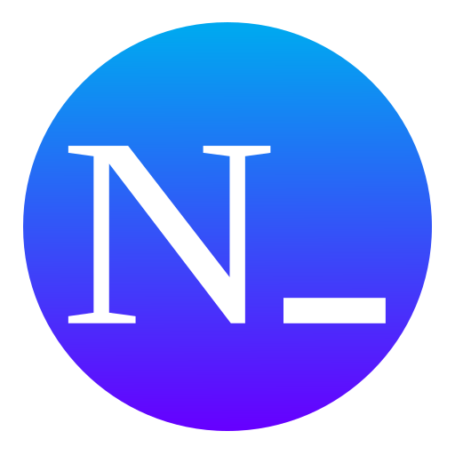
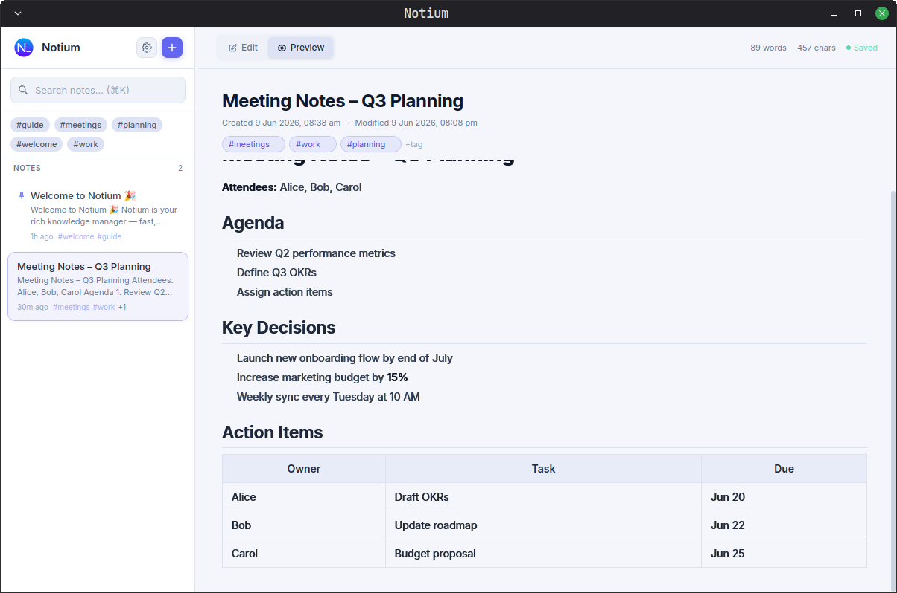

<div align="center">

</div>
<h1 align="center"> Notium </h1>

<div align="center">


</div>

Notium is a fast, local-first knowledge manager designed for speed, privacy, and simplicity. Built on top of Tauri and SvelteKit, Notium offers a native desktop experience with a sleek, customizable interface and robust data persistence.

## ✨ Features

- **Local-First Architecture:** Your data never leaves your machine. Notium uses an embedded SQLite database (`rusqlite`) powered by the Rust backend for blazing-fast and reliable storage.
- **Dynamic Theming:** Seamlessly switch between Light, Dark, or System themes. Enjoy a polished, anti-flash user experience built with TailwindCSS.
- **Markdown Support:** Write and format your notes quickly using markdown.
- **Cross-Platform:** Available for Windows, macOS, and Linux, ensuring you can manage your knowledge wherever you work.
- **Automated Builds:** Seamless CI/CD pipeline using GitHub Actions to automatically build and publish tagged releases.

## 🚀 Tech Stack

- **Frontend:** [SvelteKit](https://kit.svelte.dev/) (Svelte 5) + [TailwindCSS](https://tailwindcss.com/)
- **Backend:** [Tauri](https://tauri.app/) (Rust)
- **Database:** [SQLite](https://sqlite.org/) (via `rusqlite`)
- **Language:** TypeScript & Rust

## 🛠️ Getting Started

### Prerequisites

Ensure you have the following installed on your system:
- Node.js
- Rust
- Tauri Dependencies

### Installation

1. **Clone the repository:**
   ```bash
   git clone https://github.com/asverarise/Notium.git
   cd Notium
   ```

2. **Install frontend dependencies:**
   ```bash
   npm install
   ```

3. **Run the development server:**
   ```bash
   npm run tauri dev
   ```
   This command starts the SvelteKit frontend server and the Tauri Rust backend simultaneously.

## Screenshots



## 📦 Build for Production

To build a standalone executable for your operating system:

```bash
npm run tauri build
```
The compiled binaries will be available in `src-tauri/target/release/bundle/`.

## 🤝 Contributing

Contributions, issues, and feature requests are welcome!
Feel free to check [issues page](https://github.com/asverarise/Notium/issues).

## 📄 License

This project is licensed under the GPL v3.